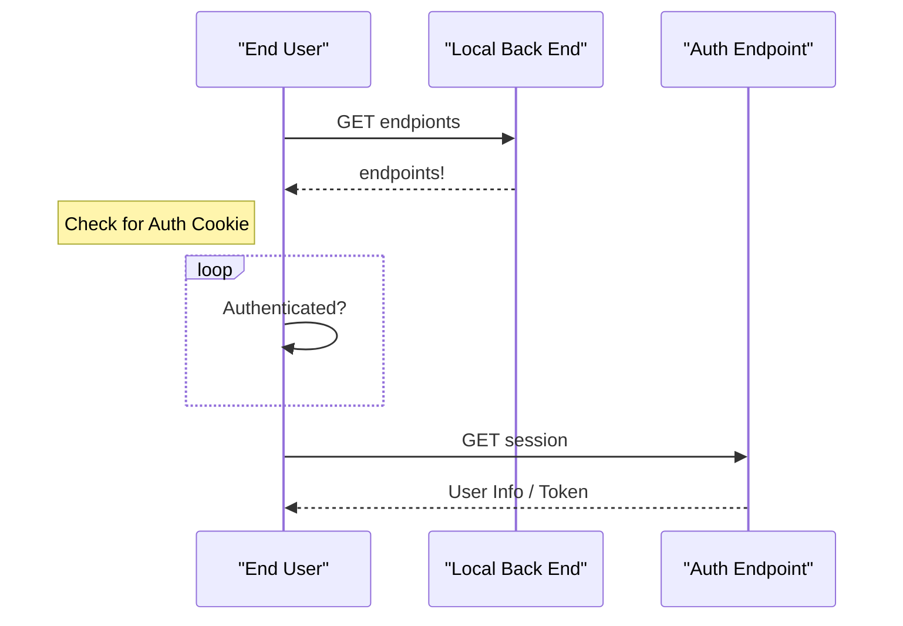

# Index

## Tasks / On Deck

- other graphs: weekly average [bar chart]
  - front end
- Show logs - add day of the week
- can change date range of graph
- swipeable rows [need use case](https://github.com/jemise111/react-native-swipe-list-view), like in strides (left to delete), right to edit
- record form: datepicker
- migrate cron job for daily report
- buttons to +/- for date or Date picker
- editable log entries
- can delete log entries
- quick entry text:
  - no exercise, biked, ran, sauna,
  
## Bugs

## Features

----

codeception coverage: unit tests
  SQL builder check

idea: auto complete api; will build dictionary of common text, on change show suggestions. When picked, replace current word w/ text

reports: refer to strides

Api for all data

New feature: spiritual, mental, physical scale tracker

habit tracker - put total and % at end of month

## Known fixes

sudo chown -R ray /home/ray/.composer/cache/repo/

`vendor/bin/phpcs --config-set default_standard PSR2`
