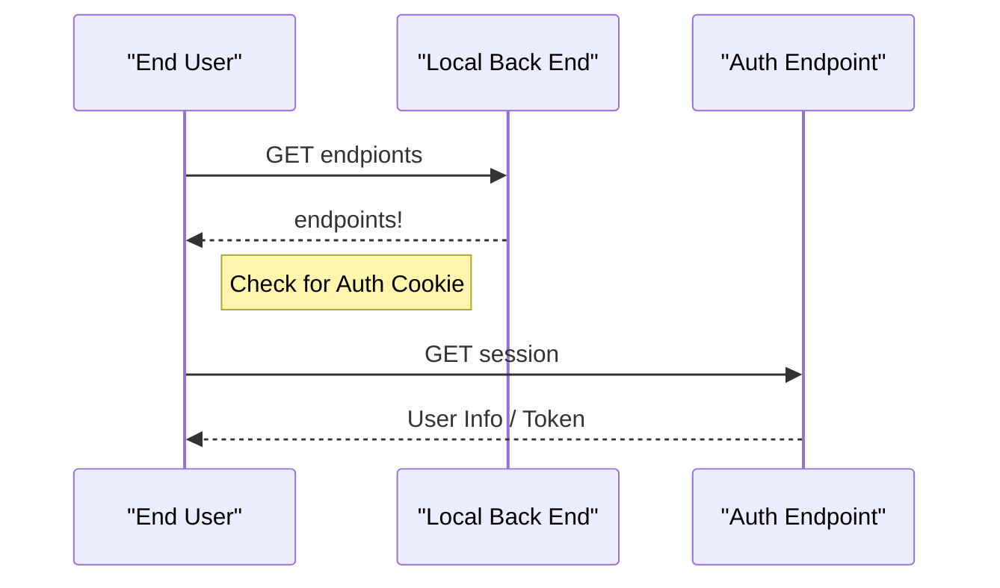

# Index

## Tasks / On Deck

- other graphs: weekly average [bar chart]
  - front end
- other graphs: monthly average
- other graphs: yearly average
- Show logs - add day of the week
- can change date range of graph
- swipeable rows [need use case](https://github.com/jemise111/react-native-swipe-list-view), like in strides (left to delete), right to edit
- record form: datepicker
- migrate cron job for daily report

## Bugs

## Features

----

codeception coverage: unit tests
  SQL builder check

buttons to +/- for date or Date picker
Show logs - nowrap date

log > entries
    better spacing; include create btn
    hide form unless click edit
    delete button

quick entry text:
   no exercise, biked, ran, sauna,

idea: auto complete api; will build dictionary of common text, on change show suggestions. When picked, replace current word w/ text

reports: refer to strides

Api for all data

New feature: spiritual, mental, physical scale tracker

habit tracker - put total and % at end of month

## Known fixes

sudo chown -R ray /home/ray/.composer/cache/repo/

`vendor/bin/phpcs --config-set default_standard PSR2`
